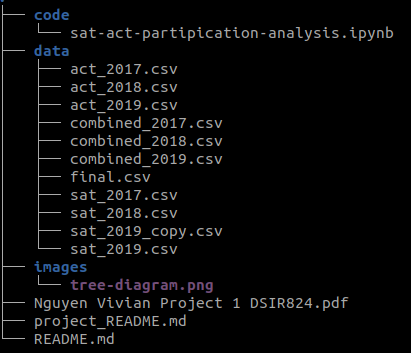

# A look into SAT/ACT Test Data Between 2017-2019

## Problem Statement:

#### Assuming you are a Data Scientist for CollegeBoard, how would you give recommendations to increase participation? Is this even a good idea?

## Executive Summary:
This project is the first of five for the general Assembly Data Science Immersive Remote course and is meant as an introduction into the skillset of a Data Analyst and Data Scientist Fellow: 

  - Technical Report Generation,
  - Git Version Control,
  - Presentation Creation
  - Proficency in using Pandas, 
  - Matplotlib, 
  - Seaborn, 
  - Numpy 
  - Jupyter Notebook

#### Data and Methodology:
SAT data was scraped from [here](https://blog.collegevine.com/here-are-the-average-sat-scores-by-state/) and [here](https://blog.prepscholar.com/average-sat-scores-by-state-most-recent), and ACT data from [here](https://www.act.org/content/act/en/research/reports/act-publications/condition-of-college-and-career-readiness-2017.html).

I cleaned the data, removing typos and converted all number texts into numerical datatypes.

Exploratory Data Analysis was Preformed, looking for trends and outliers in partipication rates

Histograms, Scatter Plots and Boxplots were created for visualization for a layman's explanation of the data.

Recommendations for next steps to the CollegBoard were written

#### Recommendations
1. Scrape the Data or Download it from my repo here; verify against other sources
2. Conduct Standard Exploratory Data Analysis (EDA)
3. Create Final Recommendations for ColegeBoard

#### Next Steps:
1. Import the final cleaned dataset into Tableau and dynamically interact with the dataset

## File Directory

## Data Dictionary

|Feature|Type|Dataset|Description|
|---|---|---|---|
state | object | N/A | 50 U.S. States and D.C.
act-17-participation | float64 | ACT | Percentage of Student Population per State as a decimal
act-17-english| float64 | ACT | ACT English Score
act-17-math| float64 | ACT | ACT Math Score
act-17-reading| float64 | ACT | ACT Reading Score
act-17-science| float64 | ACT | ACT Science Score
act-17-composite| float64 | ACT | ACT Test Composite (Total) Score
sat-17-participation| float64 | SAT | Percentage of Student Population per State as a decimal
sat-17-evidence-based-reading-and-writing | int64 | SAT | SAT Reading/Writing Score
sat-17-math | int64| SAT | SAT Math Score
sat-17-total | int64| SAT | SAT Test Composite (Total) Score
sat-18-participation| float64| SAT | Percentage of Student Population per State as a decimal
sat-18-evidence-based-reading-and-writing | int64 | SAT | SAT Reading/Writing Score
sat-18-math | int64 | SAT | SAT Math Score
sat-18-total | int64 | SAT | SAT Test Composite (Total) Score
act-18-participation| float64 | ACT | Percentage of Student Population per State as a decimal
act-18-composite| float64 | ACT | ACT Test Composite (Total) Score
sat-19-participation-rate| float64 | SAT | Percentage of Student Population per State as a decimal
sat-19-ebrw | int64 | SAT | SAT Reading/Writing Score
sat-19-math | int64 | SAT | SAT Math Score
sat-19-total | int64 | SAT | SAT Test Composite (Total) Score
act-19-participation| float64 | ACT | Percentage of Student Population per State as a decimal
act-19-composite| float64 | ACT | ACT Test Composite (Total) Score
