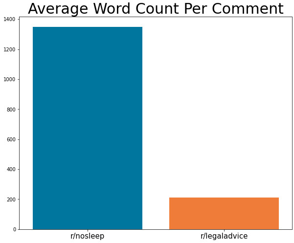
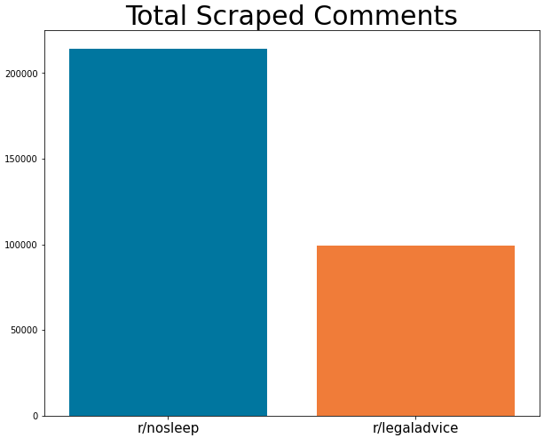
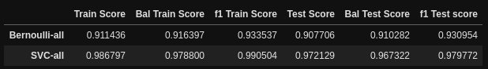
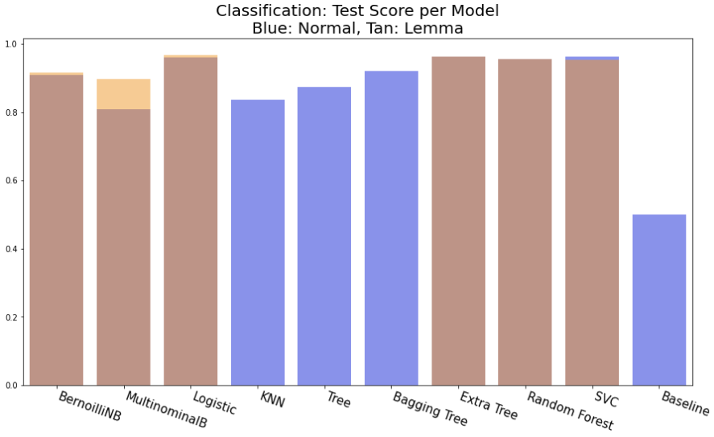
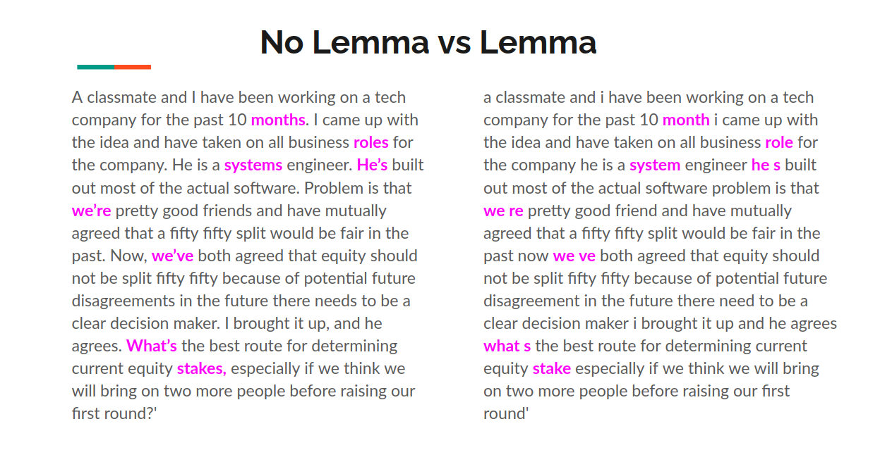

# Binary Classification of Reddit Comments by Subreddit

Natural Language Processing is one of the top problems today. One of the most famous by OpenAI has made their latest product behind a wall and given access to [Microsoft](https://syncedreview.com/2020/09/22/microsoft-gets-exclusive-license-for-openais-gpt-3-language-model/.)

Exploring this idea, how would such a computer program work? What kind of transferable knowledge can we take from more traditional statistical analysic methods like in the Ames project?

## Problem Statement:

### Can the text of a particular subreddit predict where it came from?

Can Machine Learning techniques identify the meaning of a given text and classify it to a subreddit?

## Summary:

This project is the first to work directly with strings. I developed a workflow to take in and interpret languages:

    * Identify Type of Text data 
    * Acquire  Data through an API, Web Scraping or a dataset
    * Tokenize the text to learn the vocabulary of the test data
    * Optional but encouraged: Preprocessing the data by removal of:
        * Stop Words (The, a, then, etc.)
        * Web Scraping Artifacts (URLs, & / AMP)
    * Vectorize the text into a matrix
    * Pass the matrix and its assocated label to an estimator


## Data and Methodology:
The Data has been collected from [Reddit](http://www.reddit.com) from two subreddits:

* [r/nosleep]()
* [r/legaladvice]()



These specific subreddits were chosen for the tendency to be mostly text based with few images.

Here is a sample:

### r/legaladvice:

>Pre-quarantine: A year ago every single day, the neighbor next door would knock on the door so damn loud that neighbors from the other side of the building would be able to hear it. You would think why I would be complaining about knocking but they actually knock for at least 30 minutes for the other person to open and it’s at 5AM in the morning, EVERY. SINGLE. DAY. I’m not even exaggerating. The neighbor thst was living next to them yelled at the person knocking that he would break his door if he doesn’t stop. You think he would stop but nah. It just kept omg going on. And I’m pretty sure they drove that person away because I see a different person coming in and out of there now. Then for about a good 6-8 months after the other neighbor left, they occasionally blasting music late at night usually 12AM till the brick of dawn. And almost every weekend they allow their kids stay up all night running around stomping. I’ve contacted 311 countless dozen of times and all they said is that they filled out a noise complaint to the police and they will investigate during their off duty hours. (Or something along the lines of that).

### r/nosleep:

>I must have fallen asleep I touched my left hand with my right hand and it's like it's not my hand it seems farther away than it should I can feel it but it's like I can feel my right hand touching it more than my left hand feeling it there's a strange smell like wet firewood  I can barely open my eyes it's an old wall clock looks like 6:30 no           4:40   oh my god it's not a clock eye have to get there numberwhite spheres in black void slow tracing into view on a great arc going into becoming my bodyi can't move feels like on a flat board it's a middle ground nothing is solid I can push through walls and things are faded not bright air all around I'm falling no I'm turning I'm off balance I'm barely touching the ground I can't see down hello wait don't run I'm help me it's not me it's him I mean it's you don't leave iiiiieeeeeeeeeeeeauummmmktck

Data can be found in [here](data-excerpts/), sorted by subreddit. There is a total of 9000 individual collected reddit comments. For this project, around 300,000 comments were used.



I have collected around 1,000,000 distinct reddit comments from 2011 - 2020 from these subreddits:

Subreddit|Quantity|
---------|--------|
r/askengineers       |86,000 Comments  |
r/fifthworldproblems |46,000 Comments  |
r/legaladvice        |109,000 Comments |
r/nosleep            |321,000 Comments |
r/showerthoughts     |397,000 Comments |
r/unsolvedmysteries  |9,000 Comments   |
Total:               |968,000 Comments|

### Sample Collected Data
index|title|created_utc|selftext|subreddit|media_only|author|permalink|
-----|-----|-----------|--------|---------|----------|------|---------|
0|What is the difference between Coding Bootcamps and College?|1601586972|"I just graduated high school last year and I’m taking a year off to gather myself together and waiting for this pandemic to blow over. I have the question listed above as I want to pursue in Software Engineering/ Software Development but don’t know where exactly to start. What exactly are coding boot camps, are they recommended for the field I’m trying to grow in? Is it something you attend on the side while also going to college? How long is the boot camp?I’m sorry for all the questions, if this isn’t the appropriate place to ask these questions I’ll be glad to delete this and redirect it somewhere else that is suggested. Thank you for your time."|AskEngineers|False|Growsby|/r/AskEngineers/comments/j3hi9q/what_is_the_difference_between_coding_bootcamps/

If you are interested in obtaining the scraped dataset, send me an email and I will somehow send it to you! 

Email: [nguy.vivian.vi@gmail.com](nguy.vivian.vi@gmail.com)

The workflow is split into 3 distinct parts:

1. Data Collection Through PushShift Reddit API
    * [Pushshift](https://github.com/pushshift/api)

   
2. Model Comparison
    * Bernoulli Naive Bayes, Multinominal Naive Bayes
    * Logistic Regression, KNeighbors, Decision Tree, Bagging Tree, Extra Trees, Random Forest, Support Vector Classifier, Baseline
   
    
3. Evaluation and Plotting
    * Comparison through Test Score Accuracy
    * Comparison through F1 Score
    


## Findings:

#### Our first evaluation came from using a training set of 2 %. I did not contuine using this large of a dataset because there is too much data to handle.



#### A Constant issue in Machine Learning:


#### Lemmatizing in this instance did not really help our model improve beyond its initial preformance



## Future

The findings suggest that preprocessing will have a much bigger effect on how the model handles data. Looking at this example, the lemmatizing was done poorly. However, with accuracy rates hovering around 85 - 95 %, the recommended estimator model for NLP today is through neural networks.



## File Structure:

```bash
project-3-master
├── 0_scraper.py
├── 1_model_comparison.ipynb
├── 2_plotting.ipynb
├── assets
│   ├── average_word_per_comment.png
│   ├── df_all_results.png
│   ├── lemma_no_lemma.png
│   ├── model_comparison.png
│   ├── oom.png
│   ├── reddit-2.svg
│   └── total_scraped_comments.png
├── data-excerpts
│   ├── askengineers
│   │   ├── comments_epoch_1319221376-1330177255.csv
│   │   ├── comments_epoch_1330177255-1337982601.csv
│   │   └── comments_epoch_1337982601-1345928680.csv
│   ├── legaladvice
│   │   ├── comments_epoch_1588907111-1589038608.csv
│   │   ├── comments_epoch_1589038608-1589164726.csv
│   │   └── comments_epoch_1589164726-1589272236.csv
│   └── nosleep
│       ├── comments_epoch_1270678255-1291267532.csv
│       ├── comments_epoch_1291267532-1297823322.csv
│       └── comments_epoch_1297823322-1301623584.csv
├── extras
│   └── scraper_debugging.ipynb
├── project.md
├── __pycache__
│   └── scraper.cpython-38.pyc
├── README.md
└── results
    ├── 10_000_samples.csv
    ├── scores_all.csv
    └── scores_lemma.csv

8 directories, 26 files
```
